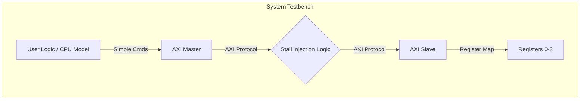

# **AXI4-Lite Master & Slave IP Core**

## **1\. Overview**

This repository contains a complete, synthesizable **AXI4-Lite Master and Slave** system implemented in Verilog. It is designed as a modular IP core for FPGA and ASIC System-on-Chip (SoC) designs.

The project focuses on **robustness and protocol compliance**. It abstracts the complex AXI handshake mechanism into a simple user interface while ensuring correct behavior under challenging conditions such as backpressure (stalls), simultaneous requests, and high-throughput traffic.

**Key Highlights:**

* **Pure Verilog:** Portable code compatible with all major EDA tools.  
* **Robust Verification:** Verified against a "Man-in-the-Middle" testbench injecting random stalls.  
* **Performance:** Optimized FSM supports back-to-back transactions with **minimal single-cycle latency**.

## **2\. Architecture**

The system connects a Master to a Slave via a verification harness. The harness acts as an interconnect, allowing the testbench to intercept signals and inject deterministic stalls for verification purposes.



## **3\. Hardware Implementation**

### **AXI Master (axi\_master.v)**

A finite-state machine (FSM) based controller that translates simple start/data signals into AXI4-Lite transactions.

* **Dual FSM:** Independent state machines for Read and Write channels allow for full-duplex operation.  
* **Arbitration:** Built-in priority logic handles simultaneous Read/Write requests (Write Priority).  
* **Protocol Safety:** Correctly handles wait-states (READY low) from the slave without dropping data.

### **AXI Slave (axi\_slave.v)**

A memory-mapped peripheral implementing a 4-register bank.

* **Address Map:** 4 x 32-bit read/write registers (0x00, 0x04, 0x08, 0x0C).  
* **Pipelined Read Path:** Includes a registered response path to break combinational timing loops and improve frequency performance.

## **4\. Verification & Simulation**

The system is verified using tb\_system.v, an advanced self-checking testbench.  
Simulation Strategy: The testbench acts as a "Man-in-the-Middle," intercepting the READY signals from the slave and forcing them low to simulate bus congestion (Backpressure).

### **Scenario A: Robustness to Backpressure (Stall Injection)**

The waveform below demonstrates a **Write Transaction** where the testbench forces AWREADY and WREADY low.

* **Key Observation:** The Master FSM holds VALID high and waits patiently until the stall is released, ensuring no data loss.  


### **Scenario B: Arbitration & High Throughput**

This capture demonstrates two advanced capabilities:

1. **Arbitration (Left):** Simultaneous Write/Read requests are handled gracefully.  
2. **Back-to-Back (Right):** A Read request issued immediately after a Write completes is executed with **minimal latency (1 clock cycle)**, maximizing bus throughput.  


## **5\. Interface Definition**

### **Configuration Parameters**

| Parameter | Default | Description |
| ----: | ----: | ----: |
| C\_M\_AXI\_DATA\_WIDTH | 32 | Width of the data bus (Supports 32/64). |
| C\_M\_AXI\_ADDR\_WIDTH | 32 | Width of the address bus. |

### **User Interface Ports (Master)**

| Signal | Direction | Description |
| ----: | ----: | ----: |
| start\_write | Input | Pulse to initiate a write transaction. |
| start\_read | Input | Pulse to initiate a read transaction. |
| user\_addr | Input | Target address for the operation. |
| user\_wdata | Input | Data payload for write operations. |
| user\_write\_done | Output | Pulsed high when write completes successfully. |
| user\_read\_done | Output | Pulsed high when read completes successfully. |
| user\_rdata | Output | Data returned from read operations. |
| master\_busy | Output | High while any transaction is in progress. |

## **6\. Project Structure**

```text
Verilog-AXI4-Core/
├── rtl/
│   ├── axi_master.v      # Synthesizable Master logic
│   └── axi_slave.v       # Synthesizable Slave logic
├── tb/
│   └── tb_system.v       # Advanced System Testbench
├── images/
│   ├── waveform_write_stall.png
│   └── waveform_arbitration.png
└── README.md
```

## **7\. Tools Used**

* **Language:** Verilog (IEEE 1364-2005)  
* **Simulation:** Cadence Xcelium (run on EDA Playground)  
* **Waveform Viewing:** GTKWave / EPWave  
* **Diagrams:** Goodnotes / Mermaid

## **8\. How to Run**

**Steps for EDA Playground:**

1. Load the files from rtl/ into the Design tab.  
2. Load tb/tb\_system.v into the Testbench tab.  
3. Set the top-level module to tb\_system.  
4. Run the simulation.
